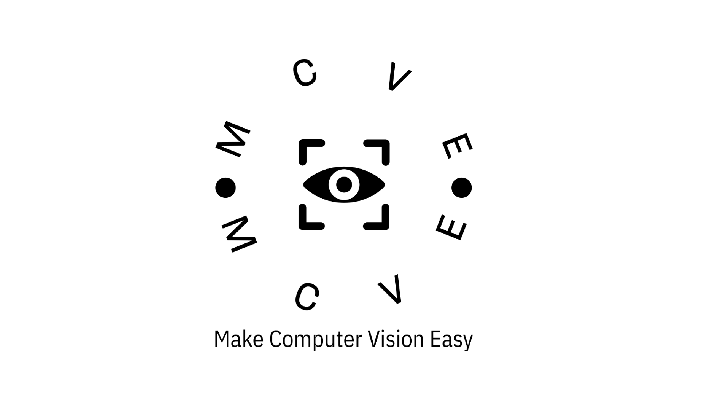

<h1 align="center">MCVE</a> 
<h3 align="left">A user library to simplify the work with computer vision! All functions are written to simplify the work, based on my experience. If you have any comments, suggestions, I will be glad if you share your experience!</h3>

  

